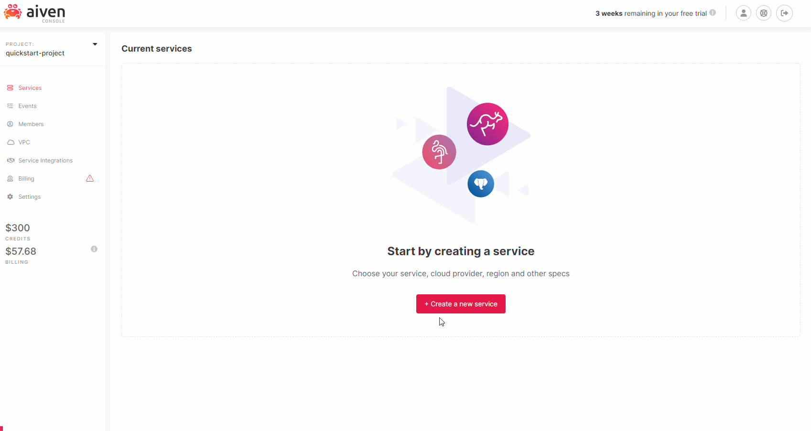
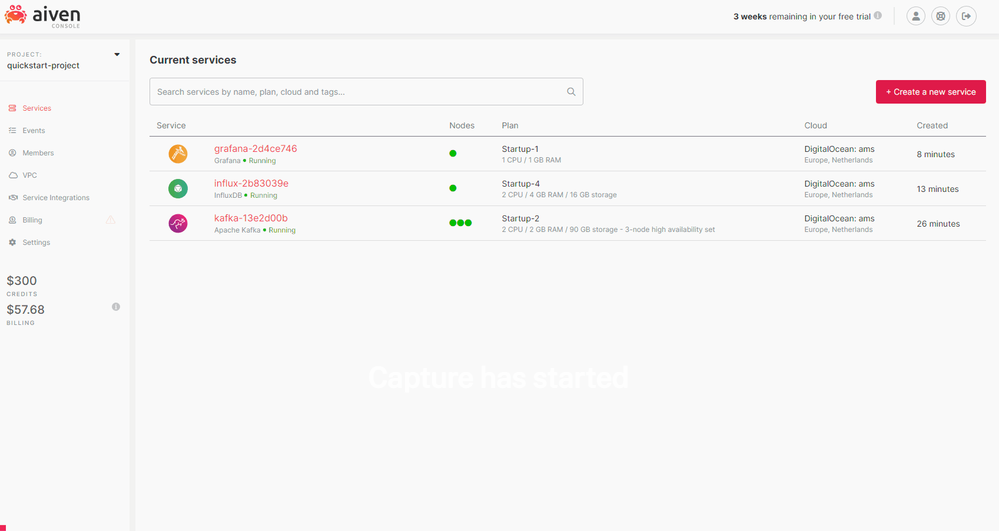
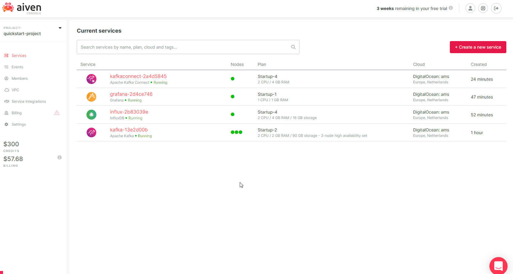
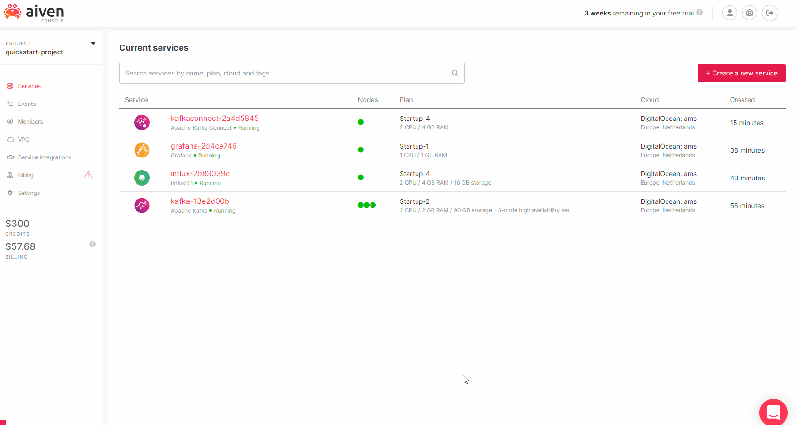
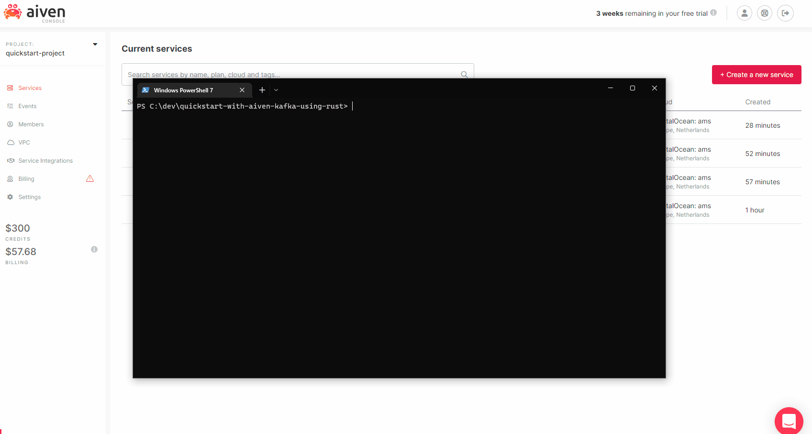
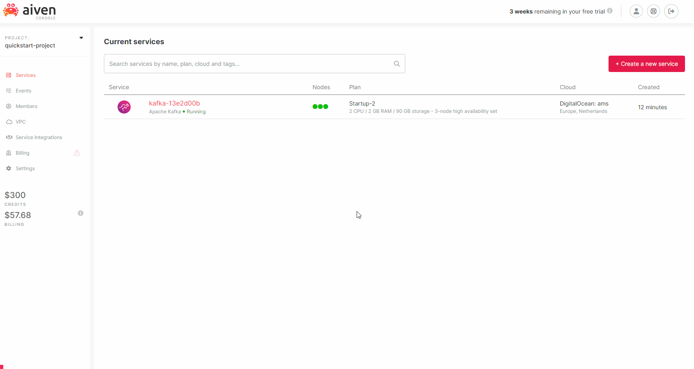
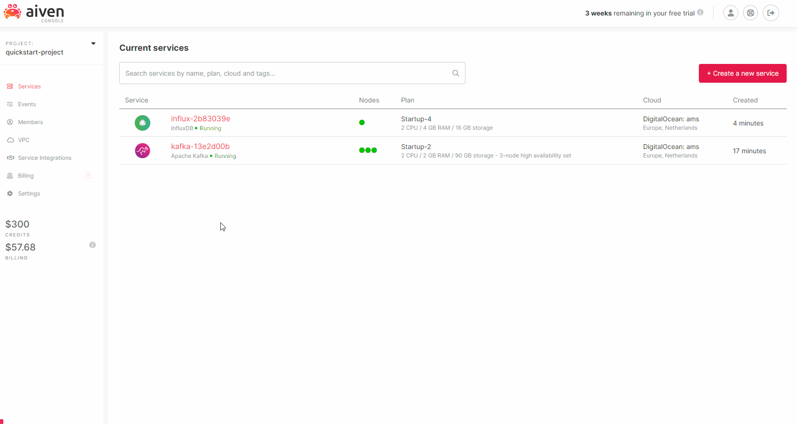
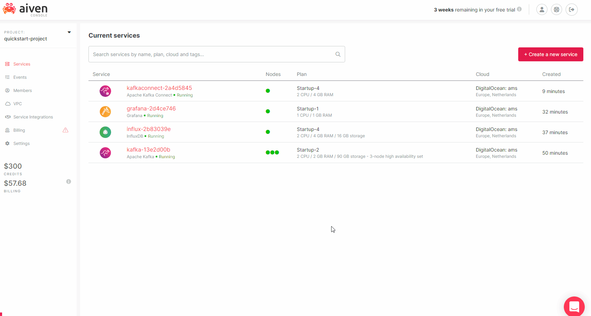

# Quickstart with Aiven Kafka using Rust

## Rust Kafka Client Application

In this quickstart we will be creating a mock IoT temperature sensor application to mesure the temprature throughout a building. We will then push these mesurements onto Aiven Kafka and then later put it into InfluxDB which is a time series database. Then as a last step we will use Grafana to visualize the temperature over time.

To get started create a new rust application using cargo by running:
```
cargo new quickstart-with-aiven-kafka-using-rust
```

We will be using these dependencies in the quickstart project:

* [serde](https://crates.io/crates/serde) - Will be used for it's serialization macros and traits
* [serde_json](https://crates.io/crates/serde_json) - Will be used for serializing data into JSON
* [uuid](https://crates.io/crates/uuid) - Will be used for generating random UUIDs
* [chrono](https://crates.io/crates/chrono) - Will be used for handling UTC time and formatting
* [rand](https://crates.io/crates/rand) - Will be used for random number generation


Add the the crates to your "Cargo.toml" dependencies section as shown below:
```toml
...
[dependencies]
serde = { version = "1.0.139", features = ["derive"] }
serde_json = "1.0.82"
uuid = { version = "1.1.2", features = ["v4", "serde"] }
rand = "0.8.5"
chrono = { version = "0.4.19",  features = ["serde"] }
```

```rust
...
#[derive(Serialize, Debug)]
pub struct SensorReading {
    id: Uuid,
    timestamp: DateTime<Utc>,
    location: String,
    temperature: f64,
}

pub struct TempratureSensor {
    location: String,
}


impl TempratureSensor {
    pub fn new(location: String) -> Self {
        Self { location }
    }

    //Simulate taking a mesurement from a temperature sensor.
    pub fn measure(&self) -> SensorReading {
        SensorReading {
            id: Uuid::new_v4(), 
            timestamp: Utc::now(), 
            location: self.location.clone(), 
            temperature: rand::thread_rng().gen_range(12.0..=30.0),
        }
    }

    //Get the mesurement and convert it to a JSON string.
    pub fn get_measurement_json(&self) -> Result<String, Box<dyn Error>> {
        Ok(serde_json::to_string(&self.measure())?)
    }
}
```

You now have the base of the project ready and you can continue to either the [Syncronus Client](#syncronus-client) or [Asyncronous Client](#asyncronous-client) section depending on your requirements.

### Syncronus Client
In this secion we will look at how to get setup and started quickly with a syncronus kafka client using [rust-kafka](https://crates.io/crates/kafka). I would recommend using [rust-kafka](https://crates.io/crates/kafka) when creating simple syncronus kafka clients in rust. The reason for this is that it's the easiest way to get started and [rust-kafka](https://crates.io/crates/kafka) includes all the necessary libraries needed and doesn't require us to install third party dependencies on the host machine.

* [rust-kafka](https://crates.io/crates/kafka) - Will be used for producing kafka messages syncronusly 
* [openssl](https://crates.io/crates/openssl) - Will be used for handling SSL in the kafka client

Add the follwoing crates as dependencies in your "Cargo.toml".

```toml
...
[dependencies]
...
kafka = "0.9.0"
openssl = "0.10.41"
```

Let's have a look at the mock IoT sensor we are going to use when exploring rust with Aiven Kafka.
```rust
...
fn main() -> Result<(), Box<dyn Error>>{
    println!("Running rust-kafka sync!");

    //Settings
    let topic = "iot";
    //Make sure to change this later on to use the Kafka service you have setup
    let bootstrap_servers = vec!["{KAFKA_SERVICE}.aivencloud.com:{PORT}".to_string()];
    let sleep_time_s = 5;

    //Certificate files with relative paths to the root folder or executable.
    let service_cert = "service.cert";
    let service_key = "service.key";
    let ca_cert = "ca.pem";

    //Setup SSL Connector and validate private key.
    let mut builder = SslConnector::builder(SslMethod::tls())?;
    builder.set_certificate_file(service_cert, SslFiletype::PEM)?;
    builder.set_private_key_file(service_key, SslFiletype::PEM)?;
    builder.set_ca_file(ca_cert)?;
    builder.check_private_key()?;

    let connector = builder.build();

    //Setup new Kafka producer.
    let mut producer = Producer::from_hosts(bootstrap_servers)
        .with_ack_timeout(Duration::from_secs(5))
        .with_required_acks(RequiredAcks::One)
        .with_security(SecurityConfig::new(connector).with_hostname_verification(true))
        .create()?;

    //Create two temperature sensors
    let bedroom = TempratureSensor::new("bedroom".to_string());
    let livingroom = TempratureSensor::new("livingroom".to_string());

    //Infinite loop
    loop {
        //Send messages sequentially
        producer.send(&Record::from_value(topic, bedroom.get_measurement_json()?))?;
        producer.send(&Record::from_value(topic, livingroom.get_measurement_json()?))?;

        //Sleep blocking the thread and continue after specified time.
        sleep(Duration::from_secs(sleep_time_s));
    }
}
```

To run the sync example run the following command (This requires that you already have setup a Kafka service):
```
cargo run --example sync
```

### Asyncronous Client

In order to communicate with Kafka asyncronusly we have to switch to another rust kafka library as rust-kafka only supports syncronus calls.
* [rdkafka](https://crates.io/crates/rdkafka) - Will be used for producing kafka messages asynchronously 
* [tokio](https://crates.io/crates/tokio) - Will be used as the asynchronous runtime

rdkafka is a wrapper around the Kafka C library and thus requires several dependencies to be installed, please follow the instructions under the "Installation" section [here](https://crates.io/crates/rdkafka).

Add the following crates as dependencies in your "Cargo.toml".

```toml
...
[dependencies]
...
rdkafka = { version = "0.28.0", features = ["cmake-build", "ssl"] }
tokio = { version = "1.20.0", features = ["full"] }
```
Let's have a look at the mock IoT sensor we are going to use when exploring rust with Aiven Kafka.

```rust
...
#[tokio::main]
async fn main() -> Result<(), Box<dyn Error>>{
    println!("Running librdkafka async!");

    //Settings
    let topic = "iot";
    //Make sure to change this later on to use the Kafka service you have setup
    let bootstrap_servers = "{KAFKA_SERVICE}.aivencloud.com:{PORT}";
    let queue_timeout_s = 5;
    let message_timeout_ms = "5000";
    let security_protocol = "ssl";
    let sleep_time_s = 5;

    //Certificate files with relative paths to the root folder or executable.
    let service_cert = "service.cert";
    let service_key = "service.key";
    let ca_cert = "ca.pem";

    //Setup new Kafka producer.
    let producer: FutureProducer = ClientConfig::new()
    .set("bootstrap.servers", bootstrap_servers)
    .set("ssl.certificate.location", service_cert)
    .set("ssl.key.location", service_key)
    .set("ssl.ca.location", ca_cert)
    .set("message.timeout.ms", message_timeout_ms)
    .set("security.protocol", security_protocol)
    .create()?;

    //Create two temperature sensors.
    let bedroom = TempratureSensor::new("bedroom".to_string());
    let livingroom = TempratureSensor::new("livingroom".to_string());

    //Infinite loop
    loop {
        //Perform both send operations concurrently. Will continue once both has completed.
        try_join!(
            send(&producer, topic, &bedroom, queue_timeout_s), 
            send(&producer, topic, &livingroom, queue_timeout_s)
        )?;

        //Sleep without blocking the thread and wakeup after specified time.
        sleep(Duration::from_secs(sleep_time_s)).await;
    }
}

async fn send(producer: &FutureProducer, topic: &str, sensor: &TempratureSensor, timeout_s: u64) -> Result<(), Box<dyn Error>> {
    
    let mesurement = sensor.get_measurement_json()?;

    //Create record that can be awaited with no key, using the specified topic and mesurement.
    let record = FutureRecord::<String, String>::to(topic).payload(&mesurement);
    
    //Send Kafka message and allow a maximum queue timeout of "timeout_s".
    let result = producer.send(
        record,
        Duration::from_secs(timeout_s)
    ).await;
    
    //Check if everything went okay, if it did then we just discard the response data as we do not need it.
    //If there was an error we return the error and discard the message information. 
    //You most likley want to handle this a bit differently in production code. 
    match result {
        Ok(_) => Ok(()),
        Err((error, _)) => Err(error)?,
    }
}
```

To run the async example run the following command (This requires that you already have setup a Kafka service):
```
cargo run --example async
```

## Aiven Setup

### Create Kafka Service

1. Create a Kafka Service by clicking "Create a new service"
2. Select Kafka
3. Select a cloud provider
4. Select the region you want to host your Kafka service in
5. Select an instance type
6. Now click "Create service"



### Enable Apache Kafka REST API (Karapace)

1. Click on the newly created Kafka service
2. Then click on the toggle to enable "Apache Kafka REST API"
3. You then get a popup where you click "Enable"



### Create Topic

1. Click on the Kafka service
2. Click on "Topics"
3. In the "Add new topic" section enter iot as the topic name
4. Click "Add topic"



### Download Certificate

1. Click on the Kafka service
2. Download the Kafka Access Key("service.key"), Access Certificate("service.cert") and CA Certificate("ca.pem")
3. Place the downloaded files in the root folder of the rust project.
4. Also make sure to update the bootstrap servers to use your Kafka service in your rust kafka application



### Start IoT Application

1. Start your rust IoT application by running ``` cargo run```
2. You can now view messages being created on the Kafka topic
3. Click on the Kafka service
4. Click on "Topics"
5. Then scroll down and click on the iot topic
6. Now click the "Messages" button
7. Change the "FORMAT" to "json"
8. Click the Fetch messages button
9. Now you will get messages that have been pushed onto the topic and you can explore and see the data in each message



### Create InfluxDB Service

1. Create a InfluxDB Service by clicking "Create a new service"
2. Select InfluxDB
3. Select a cloud provider
4. Select the region you want to host your InfluxDB service in
5. Select an instance type
6. Now click "Create service"



### Create Kafka Connect Integration

1. Create a Kafka Connect Integration by clicking your Kafka service
2. Then click "Manage Integrations"
3. Select the Apache Kafka Connect integration
4. Select new connector
5. Click "Create"
6. Now select a cloud provider
7. Select the region you want ot host your Apache Kafka Connect instance(s) in
8. Select an instance type
9. Now click "Create connector"


### Create InfluxDB Connector

1. Click on the newly created Kafka Connect Service
2. Then click on "Connectors"
3. Click on "Create new Connector"
4. Select the InfluxDB Sink Connector
5. Change the confinguration to match the below configuration but make sure to replace {INFLUXDB_SERVICE}, {PORT} and {PASSWORD} with values for your InfluxDB service

```JSON 
{
    "value.converter": "org.apache.kafka.connect.json.JsonConverter",
    "topics": "iot",
    "value.converter.schemas.enable": "false",
    "name": "iot-connector",
    "connect.influx.kcql": "INSERT INTO iot SELECT id, timestamp, location, temperature FROM iot WITHTIMESTAMP timestamp",
    "key.converter": "org.apache.kafka.connect.json.JsonConverter",
    "connect.influx.username": "avnadmin",
    "connect.influx.url": "https://{INFLUXDB_SERVICE}.aivencloud.com:{PORT}", 
    "connector.class": "com.datamountaineer.streamreactor.connect.influx.InfluxSinkConnector",
    "connect.influx.password": "{PASSWORD}",
    "connect.influx.db": "defaultdb",
    "key.converter.schemas.enable": "false"
}
```


### Create Grafana Service

1. Create a Grafana Service by clicking "Create a new service"
2. Select Grafana
3. Select a cloud provider
4. Select the region you want to host your Grafana service in
5. Select an instance type
6. Now click "Create service"



### Enable Grafana Data Source Integration

1. Click the Grafana Service.
2. Click "Manage Integrations"
3. Click on "Datasource Integration"
4. Then click on "Create"



### Create Grafana Dashboard

1. Create a new Grafana Dashboard by going to the Grafana Service and clicking the service URI.
2. Then sign in using the generated credentials for the Grafana Service.
3. Now click the plus icon, then click Add a new panel.

4. Add a query for the living room graph:
```SQL
SELECT "temperature" FROM "autogen"."iot" WHERE $timeFilter AND "location" = 'livingroom'
```
5. Change "Alias by" to "Living Room".

6. Add a query for the bed room graph:
```SQL
SELECT "temperature" FROM "autogen"."iot" WHERE $timeFilter AND "location" = 'bedroom'
```
7. Change "Alias by" to "Bed Room".

8. Now let's change some settings to make the graph look a bit nicer:
   * **Panel Options:**

   * **Title:** "Room Temperature"

   * **Threshold:**
   * **Add threshold:** Red 24
   * **Add threshold:** Blue 18

   * **Show thresholds:** As lines

9. Then save and give the dashboard a name.


Congratulations you are have now successfully setup:
* A rust application and connected it to Aiven Kafka.
* Kafka Connect with an InfluxDB connector that streams data from Kafka and puts it into a InfluxDB service.
* A Grafana integration and dashboard that fetches data from InfluxDB that is then displayed in a Grafana dashboard showcasing room temperatures over time.

In order to avoid doing all these manual steps I would highly recommend you to look into the [Aiven Terrafrom provider](https://registry.terraform.io/providers/aiven/aiven/latest/docs) which allows you to create all this using infrastructructure as code (IaC) which can be spun up and torn down with a couple commands.

## Further reading
* [InfluxDB KCQL](https://docs.lenses.io/5.0/integrations/connectors/stream-reactor/sinks/influxsinkconnector/)
* [Disable Schemas](https://docs.lenses.io/5.0/integrations/connectors/stream-reactor/sinks/payloads/)

* [Getting started with Aiven Kafka](https://help.aiven.io/en/articles/489572-getting-started-with-aiven-kafka)
* [Getting started with Aiven Grafana](https://help.aiven.io/en/articles/489587-getting-started-with-aiven-grafana)
* [Get started with Aiven.io Terraform provider](https://developer.aiven.io/docs/tools/terraform/get-started.html)